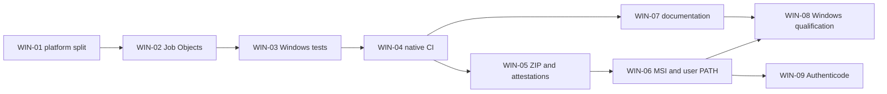

# Project status and delivery plan

This document models delivered work, current evidence and the ordered backlog. It
complements the changelog, which records user-visible changes, and the roadmap,
which keeps only the high-level direction.

## Current baseline

| Item | Current state |
|---|---|
| Latest public release | `v0.4.0` |
| Supported host | Linux amd64 and arm64 |
| Interface | French TUI plus noninteractive CLI |
| Distribution | tar.gz, Debian package and verified shell installer |
| External runtime tools | adb and scrcpy in `PATH` |
| Quality gates | tests with race detector, coverage floor, vet, staticcheck, actionlint, PTY, vulnerability scan and CodeQL |
| Supply chain | deterministic builds, SHA-256 sums, CycloneDX SBOM, signed tags and GitHub artifact attestations |
| Hardware evidence | four sanitized Android device/firmware qualification records |

## Delivered work

### Product foundation — v0.1.0 to v0.2.0

- ADB device inventory and state handling.
- Built-in and user-editable scrcpy presets.
- Exact command preview and foreground launch.
- Responsive TUI, search, paging, focus handling and keyboard help.
- CLI inventory, preset, preview and explicit launch commands.
- Persistent configuration with isolated profiles.

### Reliability and process ownership — v0.2.1

- Atomic configuration writes and recovery copies for invalid profiles.
- Pre-launch device revalidation and protection of device-selection arguments.
- Dedicated Unix process groups, bounded graceful shutdown and descendant cleanup.
- Terminal restoration and bounded in-memory scrcpy diagnostics.
- Regression coverage for cancellation, signals, long-running descendants and PTY behavior.

### Open-source and CI baseline — v0.3.0

- Public Go module, MIT license, contribution and maintenance documentation.
- Native Linux amd64 and arm64 CI.
- Race tests, coverage threshold, vet, static analysis and vulnerability scanning.
- Deterministic Linux archives with checksums and dependency notices.
- SemVer, curated changelog and automated draft releases.

### Supply-chain hardening and qualification — v0.3.1

- CodeQL, CODEOWNERS and protected-main quality gates.
- Reproducibility checks, CycloneDX SBOM and signed provenance attestations.
- Signed Git history and signed release tags attributed to `e-novatis`.
- Real-device evidence for Homatics, Pixel, Xiaomi and Strong/Skyworth devices over USB and ADB Wi-Fi.

### End-user installation — v0.4.0

- Checksum-verifying shell installer for Linux amd64 and arm64.
- PATH diagnostics for Bash, Zsh and Fish.
- Deterministic Debian packages that install the command under `/usr/bin`.
- `adb` package dependency with non-blocking `scrcpy` suggestion.
- Debian package checksums, smoke tests, reproducibility checks and attestations.

## Evidence and remaining limits

| Capability | Evidence | Limit |
|---|---|---|
| Linux behavior | Automated amd64/arm64 CI and PTY tests | Automated tests do not prove video or audio output |
| Android compatibility | Four v0.3.1 qualification records | Evidence currently uses scrcpy 4.1 and a finite device matrix |
| Debian package | APT simulation, extraction, version smoke test and KDE Discover association | GUI installation requiring local authentication was not completed on the qualification host |
| Release integrity | Reproducible artifacts, checksums, signed tag, SBOM and attestations | Windows Authenticode signing is not yet applicable |
| Windows | Architecture assessment only | Current Unix signal and process-group implementation does not compile as a Windows session backend |

## Next delivery: Windows v0.5.0

The first Windows release targets Windows 10/11 x64. ARM64 is deferred until adb,
scrcpy and hardware availability are qualified on that architecture.

| ID | Work item | Depends on | Acceptance criteria | Estimate |
|---|---|---|---|---:|
| WIN-01 | Split platform session code | — | Unix behavior remains unchanged; Windows build no longer imports Unix-only syscalls | 1 day |
| WIN-02 | Implement Windows process ownership | WIN-01 | scrcpy runs in a Job Object; Ctrl+C requests graceful shutdown; timeout kills only the owned tree | 2 days |
| WIN-03 | Make session tests cross-platform | WIN-01, WIN-02 | Go helper processes replace shell-only fixtures; Windows covers normal exit, failure, interrupt and descendants | 1.5 days |
| WIN-04 | Add native Windows CI | WIN-03 | `windows-2025` builds, tests and smoke-tests `scrcpy-tui.exe`; required check is documented | 1 day |
| WIN-05 | Build Windows release artifacts | WIN-04 | Deterministic x64 ZIP, checksum, SBOM and GitHub attestation are created from a tag | 1 day |
| WIN-06 | Build a click-to-install MSI | WIN-05 | Per-user install, PATH update, environment notification, upgrade and clean uninstall work without manual file moves | 2 days |
| WIN-07 | Document prerequisites and diagnostics | WIN-04, WIN-06 | PowerShell/Windows Terminal instructions cover adb.exe, scrcpy.exe, PATH and recovery | 0.5 day |
| WIN-08 | Qualify on Windows 11 | WIN-06, WIN-07 | MSI install/uninstall, PATH, USB and Wi-Fi ADB, presets, Ctrl+C and real scrcpy launch are recorded | 1 day |
| WIN-09 | Add Authenticode signing | Certificate | EXE and MSI signatures validate on a clean Windows host; certificate and secret rotation are documented | 1 day plus certificate lead time |

Expected engineering effort for an unsigned but qualified `v0.5.0`: **8–10 days**.
Authenticode depends on obtaining and securely provisioning a suitable code-signing
certificate.

## Cross-platform backlog after v0.5.0

| ID | Work item | Priority | Completion signal |
|---|---|---:|---|
| CORE-01 | Detect scrcpy capabilities | High | Built-in presets are checked against installed scrcpy options and produce actionable diagnostics |
| QUAL-01 | Define supported adb/scrcpy ranges | High | Version claims are derived from repeatable CI and real-device evidence |
| QUAL-02 | Complete Debian GUI install evidence | Medium | Install and uninstall through the desktop software manager are recorded on a clean supported host |
| DIST-01 | Evaluate RPM packaging | Medium | Decision is based on user demand and a qualified Fedora/RHEL-family runner |
| DIST-02 | Evaluate Homebrew | Low | macOS support exists before publishing a formula |
| REL-01 | Evaluate automated release PRs | Low | Several manual release cycles provide stable inputs and rollback expectations |
| UX-01 | Evaluate interface localization | Low | French behavior remains complete while locale selection and translations are tested |
| API-01 | Define the 1.0 stability contract | Later | CLI, configuration schema and migration policy remain stable across multiple releases |

## Release gates for v0.5.0

A Windows release may be published only when:

1. Linux required checks remain green and Unix process behavior has no regression.
2. Native Windows CI passes on the release commit.
3. The ZIP and MSI reproduce or have a documented deterministic build boundary.
4. Checksums, SBOM and attestations cover every public artifact.
5. A clean Windows 11 environment validates MSI install, PATH, upgrade and uninstall.
6. At least one Android device launches successfully over USB and ADB Wi-Fi.
7. Known limitations, including signing or SmartScreen status, appear in release notes.

